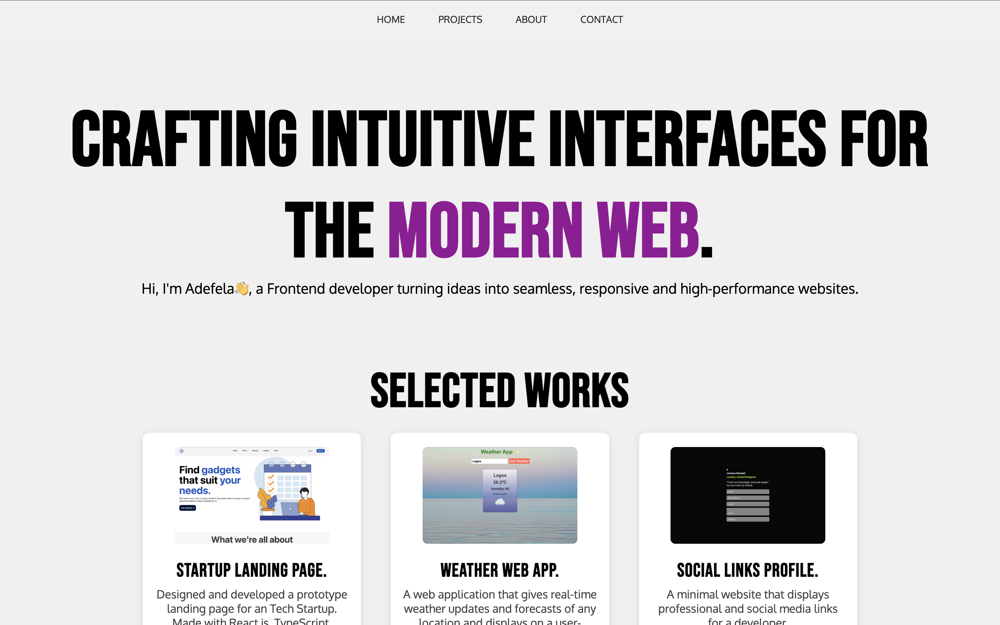

# Adefela's Portfolio

A minimal, responsive, and modern portfolio website showcasing my frontend projects, skills, and contact information. Built with HTML, CSS, and JavaScript.

[View Live Portfolio](https://adefelaadegbokun.vercel.app)

## Screenshots

## Features

- Responsive, mobile-friendly layout
- Fixed, blurred navbar with smooth scrolling
- Animated page load and scroll effects
- Projects displayed in a modern card grid
- Section links for easy navigation
- Contact and social links

## Tech Stack

- HTML5
- CSS3 (Flexbox, Grid, custom animations)
- JavaScript (vanilla)
- [Google Fonts: Bebas Neue, Oxygen](https://fonts.google.com/)

## License
This project is open source and available under the [MIT License](LICENSE).
